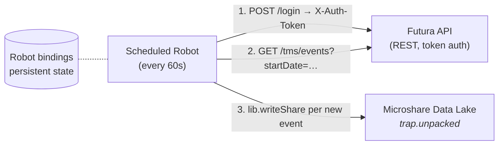

# Example: Polling an External REST API (Futura Emitter)

A single scheduled Microshare Robot that polls the [Futura Emitter Trap Management API](https://emitter-trap-management.emittercloud.m2mgate.de/q/swagger-ui/) for new trap events and writes them as standard Microshare unpacked records.

No external poller, no Lambda, no cron job — the Robot handles authentication, polling, deduplication, field mapping, and writing to the data lake.

## When to Use This Pattern

Use a polling Robot when the device platform exposes a **REST API** but does **not** offer webhooks (or webhooks are inconvenient to receive). The Robot becomes the integration: it pulls on a schedule, normalises the payload, and writes to your packed/unpacked recTypes.

For platforms that *do* offer webhooks, see [`examples/taqt/`](../taqt/) and [`examples/traplinked/`](../traplinked/) instead.

## Architecture

The Robot keeps three things in `bindings` (Composer's per-Robot persistent state) so each execution picks up where the last one left off:

- `authToken` — Futura `X-Auth-Token`, refreshed on 401
- `lastPollTime` — the `startDate` filter for the next poll
- `seenEventIds` — sliding window of recently-processed event IDs for dedup

## Futura Emitter API

| | |
|---|---|
| Trap Management API | `https://emitter-trap-management.emittercloud.m2mgate.de` |
| Server API (auth) | `https://emitterapi.m2mgate.de/emitter-server` |
| Swagger | [emitter-trap-management.emittercloud.m2mgate.de/q/swagger-ui/](https://emitter-trap-management.emittercloud.m2mgate.de/q/swagger-ui/) |

### Event Types

| Type | Severity | Description |
|---|---|---|
| `TRIGGERED` | ALARM | Trap has been triggered (catch) |
| `PROXIMITY` | INFO | Motion detected near trap |
| `LOW_BATTERY` | WARN | Battery level low |
| `NO_KEEP_ALIVE` | WARN | Device stopped reporting |
| `KEEP_ALIVE` | INFO | Periodic heartbeat |

### Device Types

| Type | Description |
|---|---|
| `TUBE_TRAP` | Emitter Tubetrap (snap trap with catch/motion modes) |
| `EMITTER_CAM` | Emitter Cam (camera trap, image attached) |

See [`event-example.json`](event-example.json) for a full Futura event payload.

## Files

| File | Purpose |
|---|---|
| [`robot.js`](robot.js) | The scheduled Robot — polls, maps, writes |
| [`event-example.json`](event-example.json) | Example Futura event payload |

## Setup

1. **Create a Robot** in Microshare Composer:
   - Set `isScheduled: true` with your desired interval (Futura's events are typically minute-scale)
   - Permissions: Share Read, Share Query, Share Write
   - Script: contents of [`robot.js`](robot.js)
   - Set the Futura credentials and the output recType at the top of the file

2. **No webhook configuration needed** — the Robot polls the Futura API directly, so nothing has to be configured on the Futura side beyond a user account with API access.

3. **Save and enable the Robot.** It will start polling on its schedule and writing unpacked records to the data lake.

## How the Robot Works

**Authentication** — `futuraLogin()`
POSTs to the Futura Server API `/rest/webapp/login` and caches the returned `X-Auth-Token` in `bindings`. Re-authenticates automatically on a 401 response.

**Polling** — `pollEvents()`
GETs `/tms/events?startDate=<lastPollTime>` via `httpGet()`. Tracks `lastPollTime` in `bindings` so each run only fetches events newer than the previous run. Deduplicates by event ID against a sliding window of the most recent 500 IDs.

**Field mapping** — `mapEvent()`
- `emitterId` → `meta.iot.device_id`
- `msgTimestamp` → `meta.iot.time`
- `type` / `severity` → `trap_event[{value, context}]`
- `emitterType`, `emitterPestType`, `stationId` → `origin.futura.*`
- The full original event is preserved in `origin.futura_event` for traceability

The output matches the schema documented in [`reference/unpacked-record-structure.md`](../../reference/unpacked-record-structure.md), so downstream Robots, Views, and the Scala pipeline can consume it without special-casing.

**HTTP GET helper** — `httpGet()`
Microshare's built-in `lib.post()` only supports POST. The Robot uses `Java.type('java.net.URL')` for GETs against the Futura API. This is a small, reusable helper that works in any GraalJS-based Robot — see [`reference/composer-api.md`](../../reference/composer-api.md) for more on the Robot runtime.

## Optional: Enriching with Device Twin Location

The example writes the location fields the Futura API itself returns (`emitterName`, `customerName`). If you maintain device twins in a Microshare **device cluster** with richer location hierarchies (Site / Building / Floor / Room / TrapID), the Robot can look up each `emitterId` in the cluster on startup and tag events with the full path.

See [`reference/pipeline-diagram.md`](../../reference/pipeline-diagram.md) for how device clusters fit into the packed → unpacked flow. The lookup is a single `httpGet()` to `/api/device/<your-cluster-recType>?details=true&discover=true` cached in `bindings` for the lifetime of the Robot.

## Adapting for Other REST APIs

This Robot is a template for **any** poll-based device platform:

1. Replace `futuraLogin()` with your API's auth flow (Basic, Bearer, OAuth — anything HTTP-based works).
2. Replace `pollEvents()` with your API's list/query endpoint and your filter (last-modified timestamp, cursor, sequence number).
3. Replace `mapEvent()` with your field mappings — produce the schema in [`reference/unpacked-record-structure.md`](../../reference/unpacked-record-structure.md).
4. The `httpGet()` helper, `bindings`-based state (auth token + cursor + dedup window), and the dedup logic are reusable as-is.

## See Also

- [`reference/composer-api.md`](../../reference/composer-api.md) — Robot runtime, auth, common helpers
- [`reference/unpacked-record-structure.md`](../../reference/unpacked-record-structure.md) — schema your Robot should produce
- [`reference/pipeline-diagram.md`](../../reference/pipeline-diagram.md) — how packed and unpacked records flow through Microshare
- [`examples/traplinked/`](../traplinked/) — same pattern, with a two-stage dev → prod progression
- [`examples/taqt/`](../taqt/) — webhook variant (the platform pushes to Microshare, no polling)
