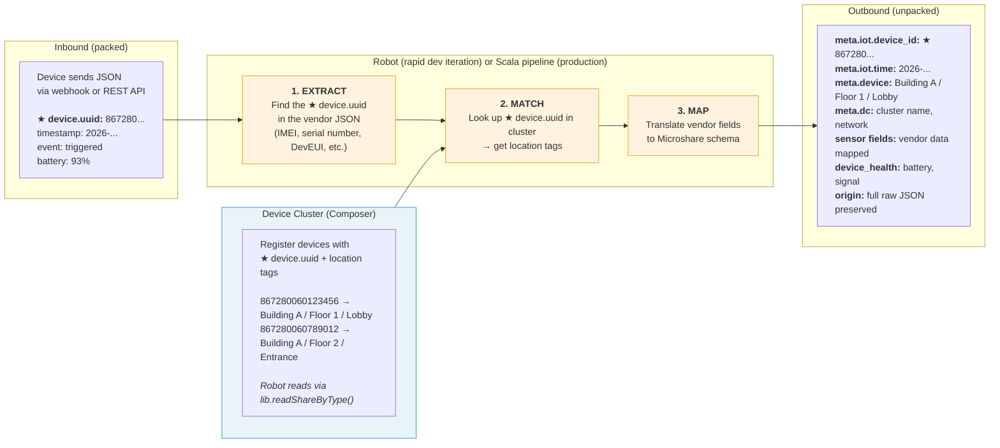
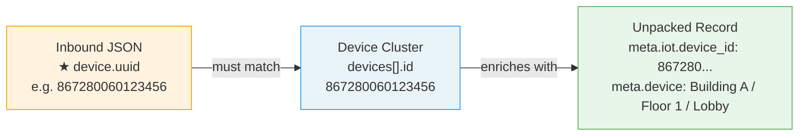
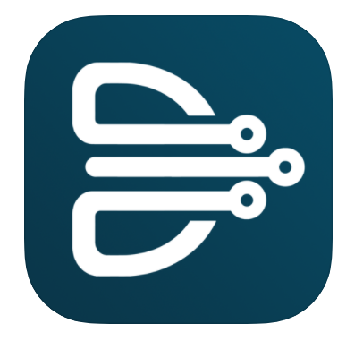
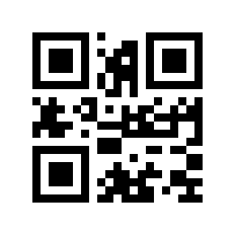
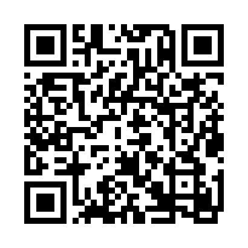

# Data Pipeline: Packed → Unpacked

How raw device data becomes a fully enriched Microshare record.

## The Unique ID Is Everything

Every device vendor puts a unique identifier somewhere in their JSON — an IMEI, a serial number, a DevEUI. This is the **single field that connects everything**:

Without a matching ID in the device cluster, the Robot can still write unpacked records — but they'll have no location context and won't appear correctly on dashboards.

## Where Different Vendors Put the device.uuid

Every vendor's JSON is different. The first job when onboarding a new device is finding where the device.uuid lives:

| Vendor | Field path in JSON | ID type | Example |
|---|---|---|---|
| Ubiqod (Taqt) | `tracker.slug` | IMEI | `867280060123456` |
| Futura Emitter | `emitterId` | IMEI or vendor ID | `1234567890ABCDE` |
| Actility (LoRaWAN) | `DevEUI_uplink.DevEUI` | EUI-64 | `58A0CB0000102AFC` |
| Your device | *check vendor docs* | *varies* | — |

The Robot's extraction function maps this vendor-specific field to Microshare's standard `meta.iot.device_id`. This is the **NetworkServer job** — and the first thing to get right.

## The device.uuid on the Physical Device

The device.uuid isn't just a data field — it's physically printed or encoded on every device, typically as a QR code or barcode. This is how devices get registered into device clusters during field installation.

Microshare's [Deploy-M](https://play.google.com/store/apps/details?id=com.microshare.DeployM2) mobile app ([guide](https://docs.microshare.io/docs/2/installer/deploy-m/app-guide/)) scans the device.uuid from the physical label, reads the device ID and type, and registers it into the device cluster with location tags (building, floor, room) — completing the digital twin in seconds.

### QR Code Formats

<table>
<tr>
<td width="150" align="center">

 
<b>Simple IMEI</b> 
<code>867280060123456</code>

</td>
<td width="150" align="center">

 
<b>LoRaWAN TR005</b> 
<code>LW:D0:DevEUI:...</code>

</td>
<td>

**Microshare QR** — devices sourced through Microshare ship with pre-printed labels that Deploy-M reads directly.

**LoRaWAN standard** — the [LoRa Alliance TR005](https://lora-alliance.org/wp-content/uploads/2020/11/TR005_LoRaWAN_Device_Identification_QR_Codes.pdf) spec encodes the DevEUI and join credentials in a standard format.

**Vendor-specific** — any proprietary QR format must be shared with Microshare to update Deploy-M's parser.

**Manual entry** — for devices without a supported QR code (e.g. cellular devices with a printed IMEI), the device.uuid can be typed into Deploy-M or registered via the Composer API.

</td>
</tr>
</table>
