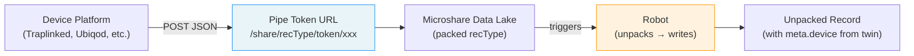

# Webhook Ingest: Connecting a Device Platform to Microshare

How to configure an external device platform to send data into Microshare.

## The Pipe Token URL

Every device platform that supports webhooks needs a destination URL. Microshare provides this via a **pipe token** — a write-only URL that accepts POST requests without any authentication header.

```
https://{ingestHost}/share/{recType}/token/{pipeToken}
```

| Part | What it is | Dev | Prod |
|---|---|---|---|
| `{ingestHost}` | Microshare API endpoint | `dapi.microshare.io` | `api.microshare.io` |
| `{recType}` | Your packed recType | `io.microshare.trap.packed` | `io.microshare.trap.packed` |
| `{pipeToken}` | Write-only token (64-char hex) | generated below | generated below |

The device platform POSTs JSON to this URL. No `Authorization` header, no API key header — the token in the URL is the credential.

## Step by Step

### 1. Choose a packed recType

Microshare recTypes follow the pattern `<reverse DNS>.<data domain>.<state>`. In production, **Microshare assigns the recTypes** for your deployment. For development and prototyping, use a descriptive name:

| Example | Notes |
|---|---|
| `io.microshare.trap.packed` | Rodent/pest trap devices |
| `io.microshare.feedback.packed` | Feedback/survey devices |
| `io.microshare.environment.packed` | Environmental sensors |

Check with Microshare for the correct production recType for your deployment.

### 2. Generate a pipe token

**Option A: via the Composer UI**

1. Log in to [dapp.microshare.io](https://dapp.microshare.io) (dev) or [app.microshare.io](https://app.microshare.io) (prod)
2. Go to **Manage → Keys → Tokens**
3. Create a new pipe token (write-only, no expiry)
4. Copy the token value

**Option B: via the OAuth2 API**

Request a token with scope `SHARE:WRITE` instead of the usual `ALL:ALL`. This produces a write-only token suitable for use as a pipe token.

```bash
curl -X POST "https://dauth.microshare.io/oauth2/token" \
  -H "Content-Type: application/x-www-form-urlencoded" \
  -d "grant_type=password&username=YOUR_USER&password=YOUR_PASS&client_id=YOUR_API_KEY&scope=SHARE:WRITE"
```

The response contains the pipe token:

```json
{
  "access_token": "42ee7050344d3b06...64-char hex...",
  "extended": {
    "identity": "your-identity-uuid",
    "identityname": "Your Identity Name"
  }
}
```

For dev, use `dauth.microshare.io`. For prod, use `auth.microshare.io`.

Your `client_id` is the API key from **Manage → Keys** in the Composer UI.

### 3. Build the webhook URL

Combine the ingest host, recType, and token:

```
https://dapi.microshare.io/share/io.microshare.trap.packed/token/YOUR_PIPE_TOKEN_HERE
```

For production, use `api.microshare.io` instead of `dapi`.

### 4. Configure the device platform

Paste the URL into your device platform's webhook configuration. Most platforms have a "destination URL" or "webhook endpoint" field in their settings — that's where this goes.

## Testing the URL

You can test without the device platform — just POST directly:

```bash
curl -X POST \
  "https://dapi.microshare.io/share/io.microshare.trap.packed/token/$PIPE_TOKEN" \
  -H "Content-Type: application/json" \
  -d '{
    "event": {
      "type": "trap_triggered",
      "timestamp": "2026-01-01T12:00:00",
      "data": {
        "device": {
          "serial_number": "TEST01",
          "name": "Test Trap",
          "type": 0,
          "status": 3,
          "battery_status": 0.8
        }
      }
    }
  }'
```

A `200` response means the data was written. Check your Robot logs or query the unpacked recType to confirm it was processed.

## Data Flow



## Next Step

Once data is flowing to the packed recType, [deploy a Robot](../example/README.md) to unpack it into Microshare's standard schema.

## Security Notes

- Pipe tokens are **write-only** — they cannot read data from the platform.
- The pipe URL is the only credential the vendor needs — don't share your Microshare login.
- Revoke tokens in **Manage → Keys** if compromised.
- Use HTTPS only — all Microshare endpoints enforce TLS.
- For dev, use `dapi.microshare.io`. For prod, use `api.microshare.io`. Do **not** use `dingest` or `ingest` hostnames — records written via those endpoints are stored separately and cannot be read through the Share API or Views.
